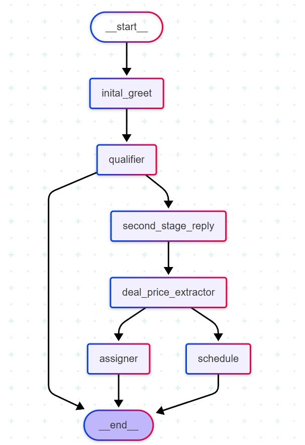

# AI Agent for to automate Hubspot like onboarding

## Overview

To automate the initial conversation with clients during onboarding and escalation processes. This agent streamlines communication, gathers necessary information, and ensures a smooth transition by addressing client needs efficiently.


## Installation

1. Clone the repository:
    ```bash
    git clone https://github.com/yourusername/Podcast-script-AI-Agent.git
    ```
2. Navigate to the project directory:
    ```bash
    cd Podcast-script-AI-Agent
    ```
3. Install the required dependencies:
    ```bash
    pip install -r requirements.txt
    ```

## Usage

1. Run the AI Agent:
    ```bash
    python main.py
    ```
2. Follow the prompts to specify the actor and recent film.

## Methodology



## Contributing

Contributions are welcome! Please fork the repository and submit a pull request.

## License

This project is licensed under the MIT License. See the [LICENSE](LICENSE) file for details.

## Contact

For any questions or suggestions, please open an issue or contact the project maintainer at sj@elintai.in.

